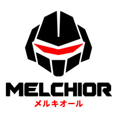

<p align="center">
  <picture>
    <source media="(prefers-color-scheme: dark)" srcset="misc/melchior-dark.svg">
    <source media="(prefers-color-scheme: light)" srcset="misc/melchior.svg">
    
  </picture>
</p>

<p align="center"><em>One agent talking to another: naming, finding, reaching and refusing.</em></p>

<p align="center">
  <a href="https://claude.ai/code/artifact/cf3ff7f0-1c1d-472a-b01e-d08a854178b1"><strong>How the four fit together</strong></a> —
  a turn end to end, writing a tool, memory both directions, what may run
</p>

melchior is the layer a coding agent uses to know about the other agents on the machine — who is
running, how each stands to it, what it may say to them, and what it may not. It knows nothing
about turns, transcripts, models or screens. Those belong to whatever harness is using it.

It was lifted whole out of [magi](https://github.com/termworks/magi), which is why the one rule
worth stating is that **nothing here knows what a harness is**. No dependency on one, and no type
from one: the vocabulary a model can call goes out as *data*, and the harness turns that into
whatever a tool looks like on its side.

## Where sessions live

```
$XDG_RUNTIME_DIR/melchior/
  myproject/                 one directory per project
    alpha-rho                a socket, named by the id and nothing else
    iota-mu
    iota-mu.parent           "alpha-rho": who started it
```

There is no server for the layer as a whole. Every session binds its own socket and answers for
itself, so the directory *is* the registry — a process that died did not get to remove itself
from a list, and a socket nobody answers is discovered on the first call rather than trusted.

Two walls, and no setting opens either past what it says:

- **the project wall** — a session sees only its own project's directory. Not "should not":
  another project's sessions are not refused, they are somewhere this one never lists.
- **the instance wall** — a main is its instance's front door; the subagents behind it are
  private. `melchior.talk` widens this to the rest of the run a session belongs to — siblings,
  and anything else started under the same root — or to everything in the project, and nothing
  widens it further.

## Commands

```sh
melchior serve      # bind this session's socket and answer for it
melchior tool       # the vocabulary a model calls, one exec per request
melchior fork       # a name and a secret for a session this one is about to start
melchior lua-api    # the Lua client library, for redirecting into a config directory
melchior verbs      # what a session answers over its socket
```

`serve` is a **child, not a daemon**: it reads its parent's pipe and exits when that closes, so a
session's socket lives exactly as long as the session does. A layer that outlived its harness
would leave a name in the directory that answers and cannot act, and a sibling sending to it
would be told the message landed.

Two things cross the pipe, one JSON object per line:

```
->  {"event":"doing","busy":true,"working_for":7,"waiting":0}
<-  {"event":"listening","at":"…/melchior/demo/alpha-rho"}
<-  {"event":"message","who":"demo/main/beta-nu","sort":"attention","text":"…"}
```

## The wire

Three transports, two shapes, one encoding — written out because it was written out nowhere, and
five wires had grown five ways to say the same thing.

| Transport | When | Framing |
|---|---|---|
| **argv** | a question with an answer and nothing to hold open | one JSON object on stdout |
| **pipe** | a parent and the child it started | newline-delimited JSON, both directions |
| **socket** | anything may knock | four bytes of big-endian length, then JSON |

JSON is on all three. It is the *encoding*, not a transport.

A **call** is answered; an **event** is not:

```
->  {"call":"status","args":[]}
<-  {"ok":true,"family":1,"n":1,"result":[{"busy":false}]}

    {"event":"listening","at":"…"}
```

`result` is a **list** and `n` says how long it is: a sibling that unpacked a bare value would
read an answer as nothing at all. `family` says which revision the reply is written in — a reader
refuses a number it does not know and tolerates one it predates. A refused call is a *reply*, not
a dropped connection.

**The tag key is `event`, everywhere, in both directions**, and `gate-wire` refuses any other.
The failure it prevents is silent: two of these wires exist as byte-identical copies in two
repositories, so when two spellings drift nothing fails and no test goes red — the surface simply
stops being answered.

## Starting a session under another

```
$ melchior fork
{"project":"demo","role":"main","id":"iota-mu","parent":"alpha-rho","token":"…",
 "environment":{"MAGI_MELCHIOR_PROJECT":"demo","MAGI_MELCHIOR_ID":"iota-mu",
                "MAGI_MELCHIOR_PARENT":"alpha-rho","MAGI_MELCHIOR_TOKEN":"…"}}
```

**melchior names, the harness spawns.** A layer that started harnesses would have to know what
one is; this hands down a name and a secret, and whoever asked starts the process with the
environment it was given. A session started that way comes up a *child*: it writes the note that
makes the tree readable, it is inside the walls `policy::between` draws, and the session that
minted its secret is the only one that can end it.

## Talking to it from Lua

`melchior lua-api` prints a plain-Lua client — framing, encoding, discovery and the verbs — with no
dependencies of its own. Siblings copy it rather than port it.

```lua
local melchior = load(src)(host.stream)
local them = melchior.connect("beta-nu")
print(them.status())
them.tell("the parser is done", "attention")
them:close()
```

## Commands

The build is `.make.lua`, read by [oslo](https://github.com/termworks/oslo). At an oslo prompt in
this directory `make` is enough; anywhere else it is `oslo make`.

```sh
make build
make test
make verify
```
